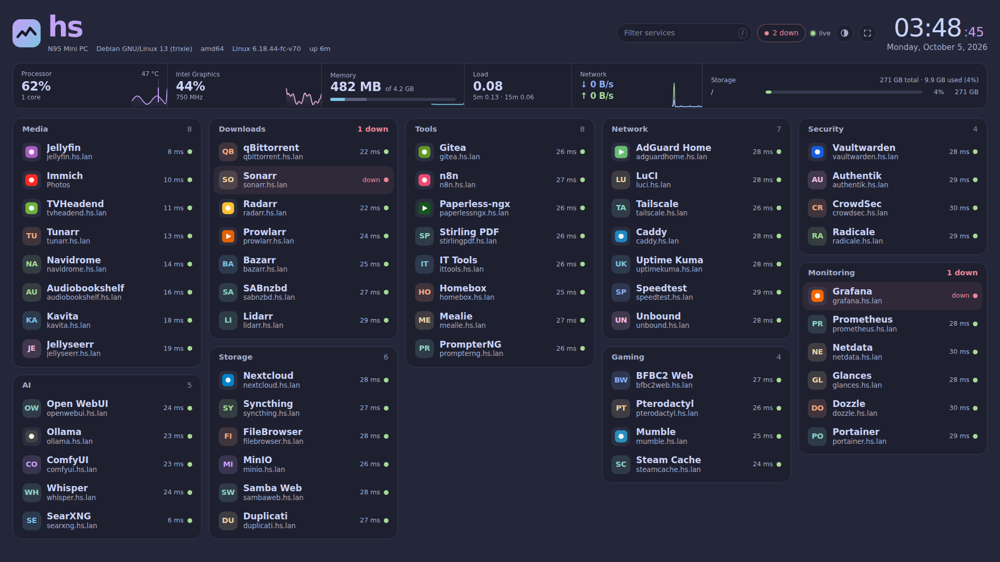
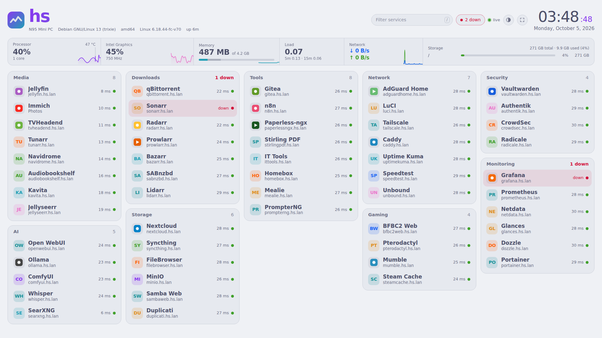

<div align="center">

# hs-dashboard

**Your whole home server on one screen. No scrolling.**

System monitor, GPU, storage and every service with a live up/down dot, in one fast page.

[](https://github.com/mmBesar/hs-dashboard/actions/workflows/build.yml)
[](https://github.com/mmBesar/hs-dashboard/pkgs/container/hs-dashboard)
[](#building-and-updates)
[](https://go.dev)
[](go.mod)
[](Dockerfile)
[](https://github.com/catppuccin/catppuccin)
[](LICENSE)
[](https://github.com/mmBesar/hs-dashboard/commits/main)

<br>



</div>

<details>
<summary>Light theme</summary>



</details>

---

## Why it's nice

- 🖥️ **Everything on one screen.** The page picks the biggest row size at which all your services and the monitor are visible with no scrolling, from a laptop to an ultrawide. Phones get one column.
- 📊 **System monitor in a single row.** Processor with per-core bars and temperature, GPU, memory, load, network and storage, with live graphs behind the numbers.
- 🎮 **GPU usage and temperature.** AMD, Intel and ARM Mali, read straight from `/sys`. [Details](#gpu).
- 💾 **Total storage at a glance.** For example "996 GB total · 412 GB used", plus a bar per disk.
- 🟢 **Live service status.** An up/down dot and response time for every service, and a chip that shows only what is down.
- 🖼️ **Your own images, any format.** `png`, `svg`, `webp`, `avif`, `jpg`, `gif` and `ico` for app logos, the server logo and the browser tab icon. [Details](#logos-and-icons).
- 🌐 **Made for domain names.** Services behind a reverse proxy, like `jellyfin.hs.lan`, need no ports anywhere.
- 🎨 **Dark and light**, Catppuccin colours you can change, a live clock and date, and a full-screen mode for a wall display.
- 📦 **Tiny and portable.** One static Go binary (standard library only) on `amd64`, `arm64` and `riscv64`. No database, no build step for the page.

---

## Contents

[Quick start](#quick-start) · [Config file](#the-config-file) · [Logos and icons](#logos-and-icons) · [GPU](#gpu) · [Storage](#storage) · [Using it](#using-it) · [Docker](#docker-setup-explained) · [Without Docker](#run-without-docker) · [Building](#building-and-updates) · [Customising](#customising) · [Troubleshooting](#troubleshooting) · [Security](#security-notes)

---

## Quick start

**1. Make the config folder** and copy the example config into it:

```bash
mkdir -p /srv/docker/cont/hs-dashboard/logos
cp config.jsonc /srv/docker/cont/hs-dashboard/
```

**2. Add the service** from [`compose.yaml`](compose.yaml) to your compose file, then:

```bash
docker compose up -d
```

**3. Open** `http://<your-server>:8080`.

Edit `config.jsonc` and save. The page picks up changes by itself within about 20 seconds, with no restart.

> Without a config file the dashboard starts with a built-in example, so you can always see it working first.

---

## The config file

`/srv/docker/cont/hs-dashboard/config.jsonc`

Lines starting with `//` are comments, and a trailing comma is fine. If you make a typo, a red banner shows the line number and the last working version stays on screen.

```jsonc
{
  "title": "",                  // big heading; empty = the machine's hostname
  "logo": "",                   // picture next to the heading (file in logos/); empty = logo.* or built-in
  "favicon": "",                // browser tab icon (file in logos/); empty = favicon.*, or the logo
  "accent": "mauve",            // colours of the heading and graphs:
  "accent2": "sapphire",        // mauve, blue, sapphire, teal, green, yellow, peach, red, pink
  "locale": "",                 // clock language, e.g. "en-GB", "ar-EG"; empty = browser
  "timezone": "Africa/Cairo",   // empty = browser timezone
  "hour12": false,              // true = 12-hour clock, false = 24-hour
  "newTab": false,              // true = open services in a new tab

  "services": [
    { "name": "Jellyfin", "url": "https://jellyfin.hs.lan", "group": "Media" },
    { "name": "Immich",   "url": "https://immich.hs.lan",   "group": "Media", "desc": "Photos" },
    { "name": "Router",   "url": "https://rt.lan",          "group": "Network", "icon": "📡", "check": "tcp://10.10.10.1:443" }
  ]
}
```

### Service fields

| Field | Required | What it does |
|---|---|---|
| `name` | yes | Title of the row. Also used to find a matching logo. |
| `url` | yes | Where the row links to. Must be `http://` or `https://`. A domain name behind your reverse proxy is ideal. |
| `group` | no | Which box the row goes in. Services without a group go in "Other". |
| `desc` | no | Small text under the name. Leave it out and the domain name is shown instead. Hidden automatically when space is tight. |
| `icon` | no | A logo file name (`"jellyfin.svg"`), a name without extension (`"jellyfin"`), an emoji (`"🎬"`) or a full image address. See [Logos and icons](#logos-and-icons). |
| `check` | no | What to test for the up/down dot, if it differs from `url`. See below. |

### How the up/down dot works

By default the dashboard requests `url` every 20 seconds, at most 16 at a time so a long list does not hit your reverse proxy in one burst. The service counts as **up** if it answers with anything below HTTP 500, so a login page (401, 403) or a redirect is still "up". Self-signed certificates, such as a reverse proxy with internal TLS, are accepted because this only checks that something answers.

Use `check` when the link and the health test should differ:

| `check` value | Meaning |
|---|---|
| `"https://jellyfin.hs.lan/health"` | Test this address instead of `url`. |
| `"tcp://host:port"` | Up if the port accepts a connection. Good for databases and non-web services. |
| `"none"` | Never checked. Shows a grey dot. |

---

## Logos and icons

Everything image-related lives in one folder, `logos/`, next to your config:

```
/srv/docker/cont/hs-dashboard/
├── config.jsonc
└── logos/
    ├── jellyfin.svg          ← app logo, found by service name
    ├── paperless-ngx.png     ← any format works
    ├── adguard_home.webp
    ├── logo.png              ← server logo next to the heading
    └── favicon.webp          ← browser tab icon
```

Supported types: `svg`, `png`, `webp`, `avif`, `jpg`, `jpeg`, `gif`, `ico`. Changes appear within about 20 seconds.

### App logos

Name the file after the service. That is all. A logo is matched automatically when its file name equals the service `name`, ignoring capitals, spaces, dashes and underscores:

| Service `name` | Matches any of |
|---|---|
| `Jellyfin` | `jellyfin.svg`, `Jellyfin.png` |
| `Paperless-ngx` | `paperless-ngx.png`, `paperlessngx.png`, `Paperless_ngx.webp` |
| `AdGuard Home` | `adguard-home.svg`, `adguard_home.png`, `AdGuardHome.webp` |

If several formats exist for the same name, the order is `svg`, `png`, `webp`, `avif`, `jpg`, `gif`, `ico`. Square images with a transparent background look best.

When the names differ, choose the image with `icon`:

```jsonc
{ "name": "Movies", "url": "https://jellyfin.hs.lan", "icon": "jellyfin.svg" }   // exact file
{ "name": "Photos", "url": "https://immich.hs.lan",   "icon": "immich" }          // immich.svg, .png, .webp ...
{ "name": "Router", "url": "https://rt.lan",          "icon": "📡" }              // emoji, no file needed
{ "name": "Wiki",   "url": "https://wiki.hs.lan",     "icon": "https://example.com/wiki.png" }  // full address
```

No logo? The row shows coloured initials, like `JE` for Jellyseerr.

### Server logo and favicon

The built-in gradient mark and tab icon are used until you add your own. Any image format works for both.

**Easiest:** drop a file called `logo.png` (or `.svg`, `.webp` ...) and one called `favicon.png` into `logos/`. They are picked up automatically.

**Or choose the file names yourself:**

```jsonc
{
  "logo": "myserver.png",       // picture next to the heading
  "favicon": "myserver-tab.webp"
}
```

- With no favicon of its own, the server logo is used for the browser tab too.
- Wide logos are fine. The height is fixed and the width follows the picture.
- Remove the files or empty the config values to go back to the built-in icons.
- A full image address (`https://...`) works in `logo` and `favicon` as well.

> Tip: good collections of self-hosted app icons exist, for example [Dashboard Icons](https://github.com/homarr-labs/dashboard-icons). Download the `svg` or `png` you need and save it with the service name.

---

## GPU

When the machine has a graphics chip that reports data, a **GPU box** appears next to the processor, with usage, temperature, clock speed and a live graph. No GPU data means no box, so nothing is wasted.

| GPU | Usage | Temperature | Clock | Notes |
|---|---|---|---|---|
| **AMD** (`amdgpu`) | ✅ | ✅ | ✅ | Also shows video memory used and total. |
| **Intel** (`i915`, `xe`), including iGPUs such as the N95 | ✅ estimated | – | ✅ | Estimated from how long the GPU is *not* idle. It tracks real use well, but can read low when only the video engine is working. Intel iGPUs have no temperature sensor of their own. |
| **ARM Mali** (Rockchip and others) | ✅ if the kernel provides it | ✅ if there is a GPU thermal zone | ✅ | Vendor kernels expose `load`, mainline `panfrost` often shows only the clock. |
| **NVIDIA** (proprietary driver) | – | – | – | The driver exposes nothing in `/sys`, so it is not shown. |
| **Raspberry Pi** (VideoCore) | – | – | – | Not exposed, so not shown. |

With more than one GPU (for example an iGPU plus a graphics card) the first is shown, and hovering the box lists all of them.

The **Processor** box shows the hottest CPU or board sensor in its top right corner. GPU, SSD and wifi sensors are left out of it.

---

## Storage

The **Storage** box shows the server's total capacity and how much is used, for example `996 GB total · 412 GB used (41%)`, then one bar per filesystem with its size.

- Several mounts on one device, such as Btrfs subvolumes, count once.
- Only real filesystems are listed: ext2/3/4, btrfs, xfs, f2fs, vfat, exfat, ntfs, zfs and bcachefs.
- Hover a disk for the device name and exact numbers.

---

## Using it

| Action | How |
|---|---|
| Filter services | Press `/`, type, then `Enter` opens the first match and `Esc` clears. |
| Show only services that are down | Click the green or red chip at the top. |
| Full screen (wall display) | Press `f`, or click the corner icon. |
| Dark or light theme | Click the half-moon icon. It remembers your choice. |
| Hover a row, disk or GPU | Shows the full address, status and exact numbers. |

The browser tab title shows how many services are down, for example `(2 down) hs`.

---

## Docker setup explained

```yaml
services:
  hs-dashboard:
    image: ghcr.io/mmbesar/hs-dashboard:latest
    network_mode: host                      # real network cards + reach to local services
    environment:
      - PUID=1000                           # run as this user
      - PGID=1000
      - TZ=Africa/Cairo
      - PORT=8080
    volumes:
      - /proc:/host/proc:ro                 # CPU, memory, load, network
      - /sys:/host/sys:ro                   # temperatures, GPU
      - /:/host/root:ro,rslave              # disks and subvolumes
      - /etc/hostname:/host/hostname:ro     # name in the heading
      - /etc/os-release:/host/os-release:ro
      - /srv/docker/cont/hs-dashboard:/config:ro   # config.jsonc + logos/
    read_only: true
    cap_drop: [ALL]
    cap_add: [SETUID, SETGID]               # only so PUID/PGID can take effect
    security_opt: [no-new-privileges:true]
```

### Environment variables

| Variable | Default | Purpose |
|---|---|---|
| `PORT` | `8080` | Port the dashboard listens on. |
| `PUID`, `PGID` | `1000` | The process switches to this user after starting. |
| `TZ` | `UTC` | Timezone for server logs. The clock on the page uses `timezone` in the config, or the browser's. |
| `CONFIG` | `/config/config.jsonc` | Path of the config file. |
| `LOGOS` | `/config/logos` | Folder with logos and icons. |
| `HOST_ROOT` | `/host/root` | Where the host's root is mounted. Use `/` when running without Docker. |

The image has no shell. It checks its own health with `/hs-dashboard -healthcheck`.

---

## Run without Docker

```bash
git clone https://github.com/mmBesar/hs-dashboard
cd hs-dashboard
HOST_ROOT=/ PORT=8080 CONFIG=./config.jsonc go run .
```

Needs Go 1.22 or newer. Logos are read from a `logos/` folder next to the config.

---

## Building and updates

The GitHub Actions workflow in `.github/workflows/build.yml` builds the image for **amd64, arm64 and riscv64** and pushes it to `ghcr.io/mmbesar/hs-dashboard`. It runs when you change the Go files, `web/`, `config.jsonc` or the Dockerfile on `main`, or from the **Run workflow** button in the Actions tab.

No emulation is used. Go cross-compiles natively and the final image is only the binary, so nothing has to run on the target CPU.

To update on your server:

```bash
docker compose pull hs-dashboard && docker compose up -d hs-dashboard
```

---

## Customising

Everything is plain text, with no build step for the page.

| File | What to edit |
|---|---|
| `web/style.css` | Colours (Catppuccin tokens at the top) and sizes. |
| `web/index.html` | Page layout. |
| `web/app.js` | Page behaviour, including the row-size steps in `STEPS`. |
| `stats.go` | What is read from `/host/proc` and `/host/sys`. |
| `gpu.go` | GPU detection and readings. |
| `services.go` | Config loading, logo matching and service checks. |
| `main.go` | Web server, routes, PUID/PGID. |

After editing `web/` or the Go files, rebuild the image (push to `main` and let the workflow run).

<details>
<summary>API endpoints</summary>

| Endpoint | Returns |
|---|---|
| `GET /api/info` | Hostname, board model, OS, kernel, architecture. |
| `GET /api/stream` | Live stats every 2 seconds (Server-Sent Events), including GPUs and disks. |
| `GET /api/history` | The last 5 minutes of graph points. |
| `GET /api/services` | Settings, logo and favicon, services and their status. |
| `GET /api/health` | `ok`, used by the Docker health check. |
| `GET /logos/<file>` | One image from the logos folder. |

</details>

---

## Troubleshooting

| Problem | Fix |
|---|---|
| Red banner at the top | `config.jsonc` has a typo at the line shown. Fix it and save. The last working version stays on screen meanwhile. |
| A service shows down but opens in the browser | The dashboard container must be able to resolve and reach the name. With `network_mode: host` it uses the host's DNS, so check that the host resolves `*.hs.lan`. You can also set `check` to an address that works from the host. |
| "No disks found" | Add the `/:/host/root:ro,rslave` volume. On bare metal set `HOST_ROOT=/`. |
| A disk is missing | Only real filesystems are shown (see [Storage](#storage)). Several mounts on one device show once. |
| No GPU box | The GPU gives no data in `/sys`. See the [GPU table](#gpu). Make sure `/sys` is mounted as `/host/sys`. |
| Intel GPU shows no temperature | Intel iGPUs have no sensor of their own. This is normal. |
| No temperature next to the processor | The board exposes no standard sensor. The dashboard reads `thermal_zone*` and `hwmon`. |
| Network always 0 B/s | Use `network_mode: host`. Without it you only see the container's own traffic. |
| Hostname shows a random id | Mount `/etc/hostname` as shown, or set `"title"` in the config. |
| A logo does not show | Check the file name against the [table](#app-logos), that it is in `logos/`, and that the extension is supported. Wait about 20 seconds. |
| Custom favicon does not change | Browsers cache tab icons hard. Reload with `Ctrl+Shift+R`, or close and reopen the tab. |
| Port already in use | Set a different `PORT`. With host networking it uses the host's ports directly. |
| Disks missing after setting `PUID` | A mount point inside a root-only folder cannot be read by a normal user. Leave `PUID`/`PGID` unset to run as root. |

---

## Security notes

- There is **no login**. Keep the dashboard on your LAN, behind your VPN (for example Tailscale), or behind a reverse proxy with authentication.
- The host folders are mounted **read-only**, the container filesystem is read-only, and all capabilities are dropped except the two needed for `PUID`/`PGID`.
- Service checks accept self-signed certificates on purpose. They only test that something answers.
- Images are served only from the one logos folder, as plain image files, with no folder listing, and SVG files are sandboxed so they cannot run scripts.

---

## License

[MIT](LICENSE)
